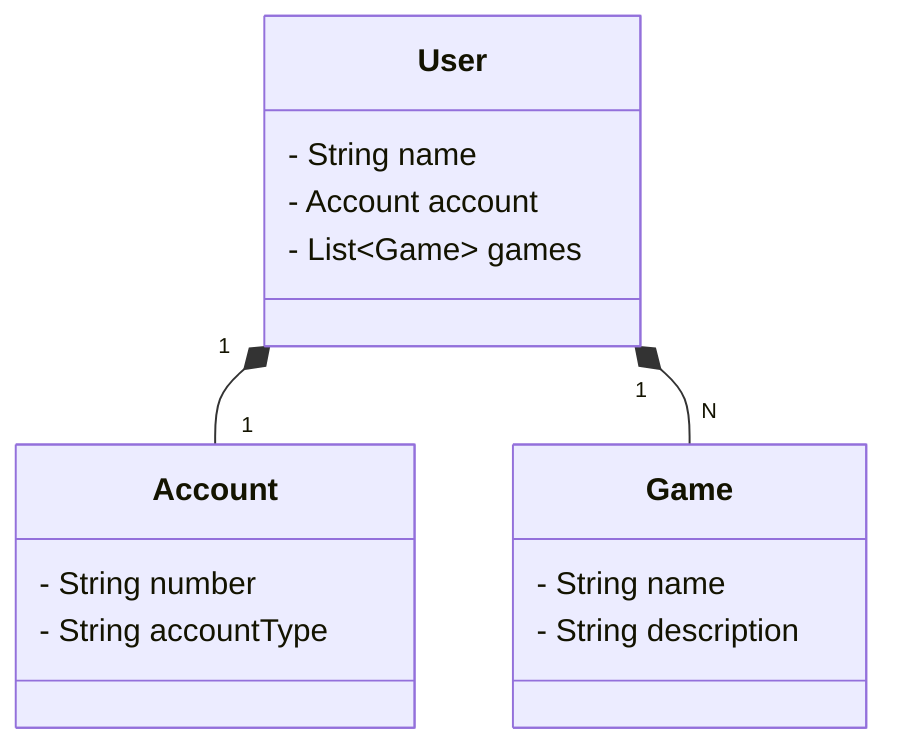

# API na Nuvem Usando Spring Boot 3, java 17 e Railway

RESTful API construída em Java 17 com Spring Boot 3.

## Diagrama de Classes

### [API (Swagger) 💻](https://api-desafio-prd.up.railway.app/swagger-ui/index.html)
Disponível no Railway por um período limitado.